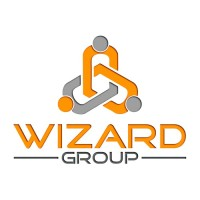
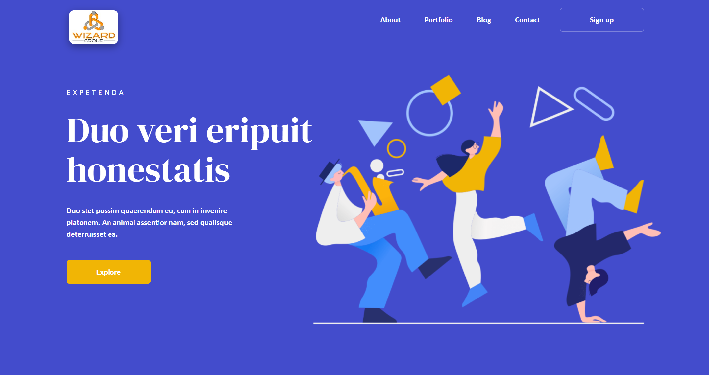
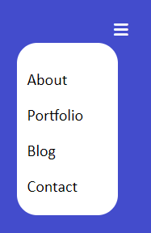
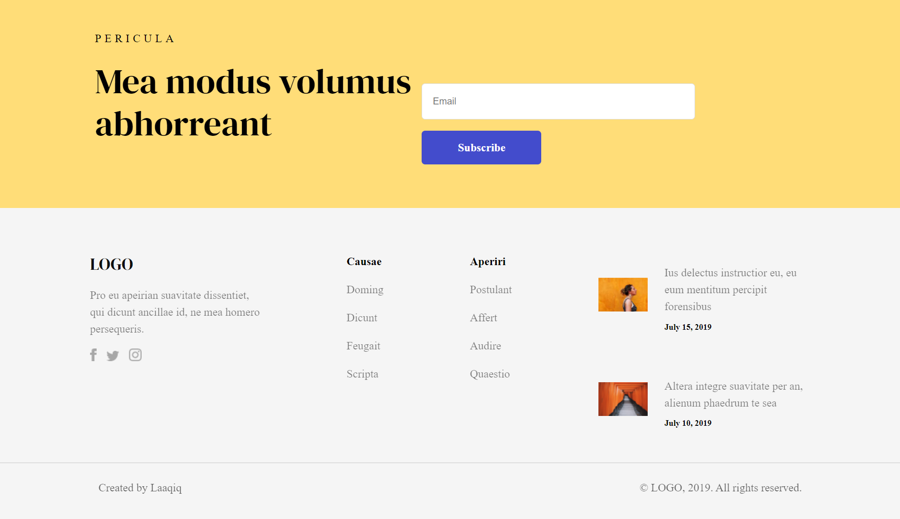

## Project Name: Wizard Group Figma Project.


### Project Logo:


## Team Members

- **Team Lead**: [Md Azad Ansari (fw29_024)]
- **Frontend Developers**:
  1. [Supriya Hatele (fw28_263)]
  2. [Pavan Kumar Vasantha (fw29_032)]
  3. [Ravi Mishra (fw29_126)]
  4. [Gaurav Dorle (fw28_199)]

## Group Name

Code Wizard

## Project Duration

4 days
## Project Overview
The **Code Wizard** team, consisting of 5 talented members, proudly presents our collaborative project completed in just 4 days. Named after our team, this project aimed to transform a Figma design into a fully functional website. We utilized HTML, CSS, and SCSS to bring the vision to life, focusing on creating a responsive and user-friendly experience.


Preview the live template here: Wizard Group Live Demo  : https://wizard-figma-project.netlify.app/

Prerequisites
A modern web browser
A text editor (e.g., VS Code, Sublime Text)
Basic knowledge of HTML/CSS and SASS
Installation
Clone the repository or download the ZIP to your local machine.
Unzip the file if you've downloaded it as a ZIP.
Open the folder in your text editor.
Use a SASS compiler to compile the .scss files to .css or edit the CSS directly.
Open the index.html file in your web browser to view the template.

## Project Features

### 1. Navigation Bar with Hamburger Menu

Our project boasts a sleek and responsive navigation bar with a hamburger menu for enhanced mobile usability. The navigation bar provides seamless access to different sections of the website, ensuring an intuitive browsing experience.

#### Navigation:


#### Hamburger Menu:



### 2. Information Section

We incorporated a dedicated section to showcase essential information about the website. This section serves as a focal point for users to gain insights into the purpose and offerings of the site.


### 3. Footer with Social Media Accounts

The project includes a comprehensive footer featuring links to the team's social media accounts. This not only promotes the team's online presence but also adds a personal touch to the website.



### Additional Features

- **Responsive Design:** The entire website is designed to be responsive, ensuring optimal user experience across various devices and screen sizes.

- **SCSS Integration:** We leveraged SCSS to enhance the maintainability and organization of our stylesheets, making it easier for developers to understand and contribute to the project.

## Technologies Used

- HTML
- CSS
- SCSS

## Design Source

The project was developed based on a detailed design provided in Figma. The design served as a blueprint for our implementation, ensuring accuracy and consistency with the envisioned user interface.

## How to Use

## Getting Started

To view the Reliance Digital Clone locally, follow these steps:

1. Clone the repository:

   ```bash
   https://github.com/azadanshu/code-wizard-8765-figma-/tree/main/code-wizard-8765-figma-
   ```

2. Open the `index.html` file in your preferred web browser.

3. Explore the clone and compare it with the original Reliance Digital landing page.


## Acknowledgments

We would like to express our gratitude to the entire Code Wizard team for their dedication and collaborative spirit during the project.


# Linkedin-Profiles

 <a href="https://www.linkedin.com/in/md-azad-ansari-b08196218" target="_parent">Azad</a> 
 
 <a href="https://www.linkedin.com/in/supriya-hatele-b0696b1bb" target="_parent">Supriya</a>
 
 <a href="https://www.linkedin.com/in/pavankumar25/" target="_parent">Pavan</a>
 
 <a href="https://www.linkedin.com/in/ravimishra007" target="_parent">Ravi</a>


